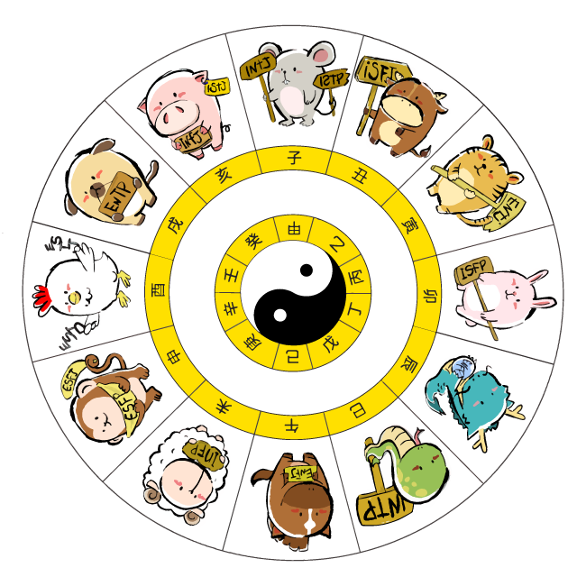
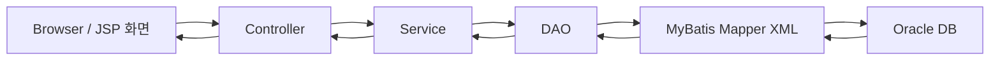
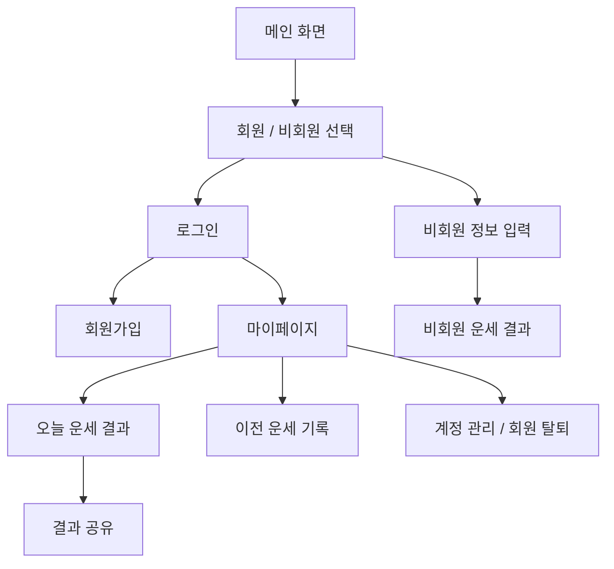

# NEPALZZAYA

> MBTI, 성별, 띠 정보를 바탕으로 오늘의 운세를 확인하고 기록할 수 있는 Spring MVC 기반 웹 프로젝트입니다.


## 목차

- [프로젝트 소개](#프로젝트-소개)
- [개발 배경 및 목적](#개발-배경-및-목적)
- [주요 기능](#주요-기능)
- [데모 및 미리보기](#데모-및-미리보기)
- [설치 및 사용 방법](#설치-및-사용-방법)
- [기술 스택](#기술-스택)
- [구조 설계](#구조-설계)
- [폴더 구조](#폴더-구조)
- [라이선스](#라이선스)

## 프로젝트 소개

NEPALZZAYA는 사용자가 자신의 MBTI, 성별, 띠 정보를 입력하면 오늘의 운세를 보여주는 웹 서비스입니다. 회원은 로그인 후 운세 결과를 확인할 수 있고, 하루 단위로 최신 운세 기록을 저장해 이전 검사 기록을 다시 열람할 수 있습니다.

프로젝트는 Java 8, Spring MVC, MyBatis, Oracle DB, JSP 기반으로 구현되어 있으며 Eclipse/STS와 Tomcat 9 환경에서 로컬 실행하는 것을 기준으로 합니다.

## 개발 배경 및 목적

MBTI와 띠처럼 친숙한 개인 정보를 활용해 가볍게 즐길 수 있는 운세 서비스를 만드는 것을 목표로 했습니다. 단순히 결과를 보여주는 화면에서 끝내지 않고, 로그인/회원가입/마이페이지/기록 열람/공유/회원 탈퇴까지 웹 서비스의 기본 흐름을 경험할 수 있도록 구성했습니다.

이 프로젝트에서 중점적으로 다룬 내용은 다음과 같습니다.

- Spring MVC 기반 요청 흐름 이해
- JSP 화면과 Controller/Service/DAO 계층 연결
- MyBatis Mapper를 활용한 Oracle DB 연동
- 회원 세션 기반 로그인 상태 관리
- 운세 결과 기록 저장 및 조회
- 사용자 화면 UI 정리와 공통 헤더 적용

## 주요 기능

| 기능 | 설명 |
| --- | --- |
| 메인 화면 | NEPALZZAYA 소개 화면과 회원/비회원 운세 확인 진입 |
| 회원가입 | ID 중복 확인, 닉네임, 비밀번호, 성별, MBTI, 띠 정보 입력 |
| 로그인/로그아웃 | 세션 기반 로그인 처리 및 로그아웃 후 로그인 화면 이동 |
| 오늘 운세 확인 | 회원 정보의 MBTI, 성별, 띠 조합에 따라 운세 결과 출력 |
| 비회원 운세 확인 | 로그인 없이 MBTI, 닉네임, 성별, 띠 입력 후 운세 확인 |
| 운세 결과 고정 | 같은 MBTI/성별/띠 조합은 일관된 운세 결과가 나오도록 구성 |
| 이전 운세 기록 | 회원이 확인한 운세를 하루 1개 최신 기록으로 저장하고 열람 |
| 결과 공유 | 운세 결과 URL을 Facebook, Naver, Twitter, 링크 복사로 공유 |
| 마이페이지 | 오늘 운세 확인, 이전 운세 확인, 계정 관리 진입 |
| 회원 탈퇴 | 회원 정보와 관련 기록 삭제 |
| 공통 UI | 헤더, 로고, 파비콘, 폰트, 버튼 hover 스타일 통일 |

## 데모 및 미리보기

### 로컬 실행 URL

Tomcat 실행 후 아래 주소에서 확인할 수 있습니다.

| 화면 | URL |
| --- | --- |
| 메인 | `http://localhost:8081/ehr/user/mainPage.do` |
| 로그인 | `http://localhost:8081/ehr/ELCARO/loginView.do` |
| 회원가입 | `http://localhost:8081/ehr/ELCARO/SignUp.do` |
| 마이페이지 | `http://localhost:8081/ehr/ELCARO/myPage.do` |
| 오늘 운세 결과 | `http://localhost:8081/ehr/ELCARO/result.do` |
| 이전 운세 기록 | `http://localhost:8081/ehr/ELCARO/resultSelect.do` |
| 공유 화면 | `http://localhost:8081/ehr/ELCARO/shareDesiredURL.do` |

### 화면 미리보기

<p align="center">
  
</p>

| 화면 | 미리보기 포인트 |
| --- | --- |
| 메인 화면 | NEPALZZAYA 로고, YES/NO 진입 버튼, 통일된 헤더 |
| 로그인 화면 | 헤더 포함, 중앙 정렬된 로그인 폼 |
| 마이페이지 | 운세 확인/기록 확인/계정 관리 동선 분리 |
| 결과 화면 | MBTI 이미지, 띠 이미지, 운세 메시지, 공유 버튼 |
| 기록 화면 | 하루 1개 기준 최신 운세 기록 목록 |
| 공유 화면 | 한 줄 아이콘 공유 UI와 뒤로가기 버튼 |

## 설치 및 사용 방법

### 1. 필수 설치

- JDK 8
- Apache Tomcat 9
- Oracle 11g XE 또는 Oracle XE
- Maven 3.x
- Eclipse 또는 STS

### 2. 프로젝트 가져오기

```bash
git clone https://github.com/cheezcyj/NPZY.git
cd NPZY
```

Eclipse/STS에서는 `Existing Maven Projects`로 프로젝트를 import합니다.

### 3. DB 설정

기본 DB 연결 정보는 아래 파일에 있습니다.

```text
src/main/java/resource/config/database.properties
```

현재 기본 설정:

```properties
jdbc.driver = oracle.jdbc.driver.OracleDriver
jdbc.url = jdbc:oracle:thin:@127.0.0.1:1521:XE
jdbc.username = YOUR_DB_USERNAME
jdbc.password = YOUR_DB_PASSWORD
```

Oracle XE에 본인 로컬 DB 계정과 프로젝트에서 사용하는 테이블을 준비해야 합니다.

주요 테이블 예시:

- `ACCOUNT_TB`
- `MBTI_TB`
- `RESULT_TB`
- `URL_TB`

### 4. Maven 빌드

```bash
mvn -DskipTests package
```

Windows에서 Maven 경로를 직접 지정해야 한다면 예시는 아래와 같습니다.

```powershell
& 'C:\apache-maven-3.9.16\bin\mvn.cmd' -DskipTests package
```

### 5. Tomcat 실행

1. Eclipse/STS에서 Tomcat 9 서버를 추가합니다.
2. 프로젝트를 서버에 Add 합니다.
3. Tomcat을 Start 합니다.
4. 브라우저에서 아래 주소로 접속합니다.

```text
http://localhost:8081/ehr/user/mainPage.do
```

포트가 8080이면 아래처럼 접속합니다.

```text
http://localhost:8080/ehr/user/mainPage.do
```

## 기술 스택

| 구분 | 기술 |
| --- | --- |
| Language | Java 8, JavaScript, HTML, CSS |
| Backend | Spring MVC 5.3.27 |
| View | JSP, JSTL |
| Database | Oracle XE |
| Persistence | MyBatis, MyBatis-Spring |
| Connection Pool | Apache Commons DBCP |
| Build | Maven |
| Server | Apache Tomcat 9 |
| Library | jQuery, Gson, Log4j, SLF4J |
| IDE | Eclipse / STS |

## 구조 설계

### MVC 요청 흐름



### 주요 도메인 흐름



### 주요 Controller

| Controller | 역할 |
| --- | --- |
| `MainPageController` | 메인 화면 진입 |
| `LoginContoller` | 로그인, 로그아웃, 회원 탈퇴 |
| `SignUpController` | 회원가입, ID 중복 확인 |
| `MyPageController` | 마이페이지, 계정 관리 화면 |
| `ResultController` | 회원/비회원 운세 결과 조회 및 기록 저장 |
| `Result_UrlController` | 이전 운세 기록 조회 |
| `ShareController` | 공유 화면 URL 조회 |
| `NotMemberController` | 비회원 입력 화면 |

## 폴더 구조

```text
NPZY
├─ pom.xml
├─ LICENSE
├─ README.md
├─ src
│  ├─ main
│  │  ├─ java
│  │  │  ├─ com/pcwk/ehr
│  │  │  │  ├─ login
│  │  │  │  ├─ signUp
│  │  │  │  ├─ myPage
│  │  │  │  ├─ result
│  │  │  │  ├─ resultUrl
│  │  │  │  ├─ share
│  │  │  │  ├─ NotMember
│  │  │  │  └─ cmn
│  │  │  └─ resource/config
│  │  │     └─ database.properties
│  │  ├─ resources
│  │  │  └─ mapper/elacro
│  │  │     ├─ login.xml
│  │  │     ├─ signUp.xml
│  │  │     ├─ result.xml
│  │  │     ├─ result_url.xml
│  │  │     ├─ share.xml
│  │  │     └─ NotMemberMapper.xml
│  │  └─ webapp
│  │     ├─ WEB-INF/views/user
│  │     │  ├─ header.jsp
│  │     │  ├─ Ne01_MainPage.jsp
│  │     │  ├─ Ne07_Login.jsp
│  │     │  ├─ Ne08_SignUp.jsp
│  │     │  ├─ Ne09_MyPage.jsp
│  │     │  ├─ Ne10_ResultUrl.jsp
│  │     │  ├─ Ne11_SharePage.jsp
│  │     │  └─ Ne12_AccountPage.jsp
│  │     └─ resources
│  │        ├─ css
│  │        ├─ images
│  │        ├─ js
│  │        └─ favicon.svg
│  └─ test
└─ target
```

## 라이선스

이 프로젝트는 MIT License를 따릅니다. 자세한 내용은 [LICENSE](LICENSE)를 확인하세요.
